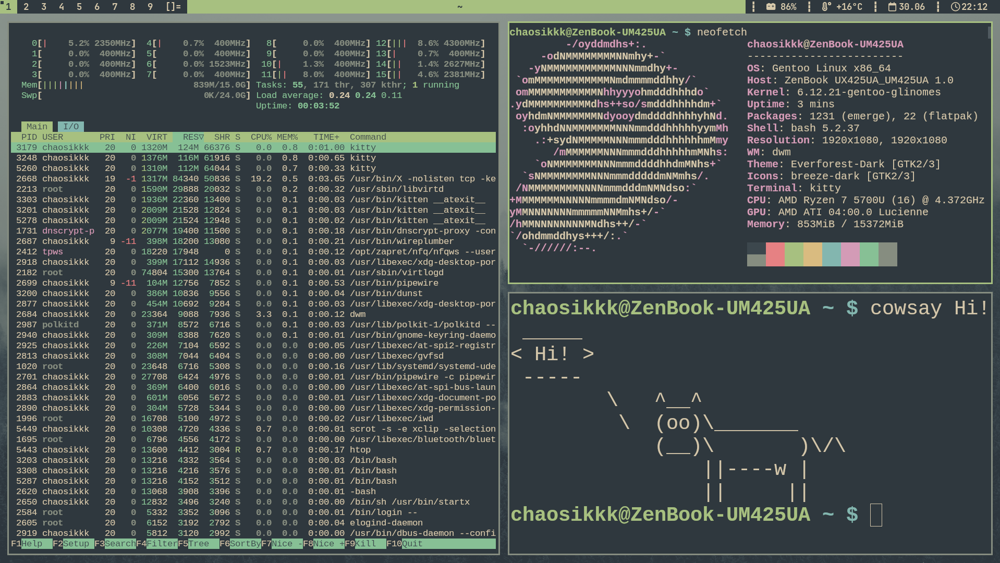

# My dwm configuration

My dwm configuration with several patches and everforest color scheme



The following patches have been installed:
- actualfullscreen
- alwayscenter
- systray
- truecentredtitle

Also installed dwmblocks as status bar

## Installation

```bash
git clone https://github.com/Chaosikkk/mydwm.git
cd mydwm/dwm
make && sudo make install
cd ../dwmblocks
# Set your location for weather block in blocks.def.h
# You should also set your battery location (or remove battery info if you don't have one)
make && sudo make install
```
To start, run ```startx``` in tty
